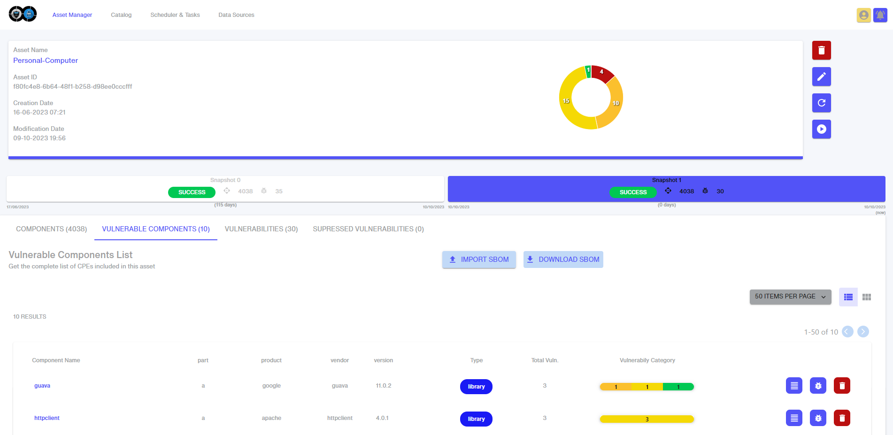
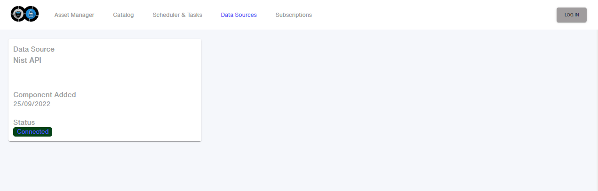

# THOE

The **Threat Oracle Engine** (THOE) is the tool for scanning the system for known vulnerabilities based on the information obtained from online vulnerability databases, such as, for example, [NVD](https://nvd.nist.gov/) database. THOE is a solution for industrial control systems, including embedded systems with limited resources, and it enables:
-	Automatic detection of publicly known vulnerabilities affecting software and hardware used by a product during its development process and whole lifecycle.
-	Searching for vulnerabilities published in different data sources, such as NVD, ExploitDB, etc. It is flexible enough to allow adding new sources.
-	Continuous monitoring for vulnerabilities and configuration
-	Local or remote search of vulnerabilities


## Prerequisites
Prerequisites for running THOE.
- OS: Ubuntu 22.04
- Kubernetes version 1.245
- Distro: microK8s

## How to run
Instructions for running THOE.

1. Install a kubernetes cluster based on a single node
    1. Install microK8s. \
```$ sudo snap install microk8s --classic --channel=1.25/stable```
    2. Set permissions to access MicroK8s.\
```$ sudo usermod -a -G microk8s $USER``` \
```$ sudo chown -f -R $USER ~/.kube``` \
```$ su - $USER```
    3. Output status information, including the current state of the MicroK8s node and a list of all the available extensions. \
```$ microk8s status --wait-ready```
    4. Check that the Kubernetes cluster is up and running. \
```$ microk8s kubectl get nodes```

2. Install the necessary plugins
    1. To operate and deploy the PKI. \
```$ microk8s enable dns``` \
```$ microk8s enable hostpath-storage``` \
```$ microk8s enable cert-manager``` \
```$ microk8s enable ingress```
    2. Kubernetes LoadBalancer service. \
NOTE: the CDIR subnet range can vary depending on the network interface used. \
```$ microk8s enable metallb``` \
```$ microk8s enable metallb:192.168.1.240/24```

3. Check the resources/applications launched in the kubernetes cluster. \
```$ microk8s kubectl get pods -A```

4. Deployment \
```$ microk8s helm3 install thoe . --create-namespace -n thoe --set storageClassName=microk8s-hostpath --set domain={DOMAIN}```

## User manual

### Main dashboard

The main dashboard of THOE provides an overall statisticall analisys of the data that is stored on THOE, including the amount of known vulnerabilities and how critical are those vulnerabilities as specify by the NIST.


### CVE catalog

In the CVEs catalog you can see all the CVEs stored in THOE database. For now, THOE has more than 200K CVEs stored.


### CPE catalog

In the CPEs catalog you can see all the CPEs stored in THOE database. For now, THOE has more than 1M CPEs stored.


### Asset Manager

The Asset Manager page is where you define the set of components of your asset inventory, including HW platforms, SW applications and Operative Systems. THOE tracks the vulnerabilities associated to each one. 


### Asset Information

Within each asset, there is a list of components, with it associated CPE. The components defined here are monitored by THOE. THOE performs periodicall searchs to the public vulnerabilities databases in order to check if there are new vulnerabilities (CVEs) that may affect some component. 




### Data Sources

The Data Sources panel lists the data sources from which THOE obtains the information (i.e, NIST).



### Scheduler 

The Scheduler allows importing the CPEs and CVEs from data sources within a user-configurable period, as well as running the assets audit, which analyses the vulnerabilities associated with an asset.


### Subscriptions

The subscriptions page allows the user to subscribe to e-mails on both snapshot information (informs when an asset audit is completed) and alerts (informs with each new vulnerability found).


## CI/CD

THOE tool contributes to the CI/CD of the scenarios defined in VeriDevOps. In particular, THOE contributes to the CI/CD cycle in the plan and monitor phases.


